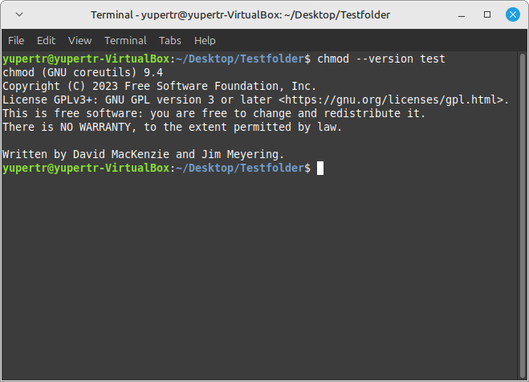

# Linux Terminal Komutları
## Giriş ve Açıklama
Bu dosya Linux işletim sistemi için kullanılan komutların açıklamalarını içerir.
## Komutlar
### ls
* Açıklama: Belirtilen dizindeki dosya ve klasörleri listeler.
* Kullanım: `ls [dizin]`
* 
### cd
* Açıklama: Belirtilen dizine geçer.
* Kullanım: `cd [dizin]`
* 
### mkdir
* Açıklama: Belirtilen konumda yeni bir dizin oluşturur.
* Kullanım: `mkdir [dizin]`
* 
### rmdir
* Açıklama: Belirtilen konumdaki boş dizinleri siler.
* Kullanım: `rmdir [dizin]`
* 
### cp
* Açıklama: Belirtilen dosyayı belirtilen hedefe kopyalar.
* Kullanım: `cp [dosya] [hedef]`
* 
### rm
* Açıklama: Belirtilen dosyayı siler.
* Kullanım: `rm [dosya]`
* 
### mv
* Açıklama: Dosya ve dizinleri yeniden adlandırır veya taşır.
* Kullanım: `mv [eski_ad] [yeni_ad]` veya `mv [kaynak] [hedef]`
* 
### clear
* Açıklama: Terminal ekranını temizler.
* Kullanım: `clear`
* 
### man
* Açıklama: Komutların kılavuz sayfalarını gösterir.
* Kullanım: `man [komut]`
* 
### exit
* Açıklama: Terminali kapatır.
* Kullanım: `exit`
* 
### cat
* Açıklama: Belirtilen dosyanın içeriğini görüntüler.
* Kullanım: `cat [dosya]`
* 
### echo
* Açıklama: Belirtilen metni ekrana yazdırır veya dosyaya yönlendirir.
* Kullanım: `echo [metin]` veya `echo [metin] > [dosya]`
* 
### date
* Açıklama: Sistem tarihini görüntüler veya ayarlar.
* Kullanım: `date`
* 
### uname
* Açıklama: Sistem bilgilerini görüntüler.
* Kullanım: `uname -a`
* 
### ps
* Açıklama: Çalışan işlemleri gösterir.
* Kullanım: `ps aux`
* 
### kill
* Açıklama: Belirtilen işlemi sonlandırır.
* Kullanım: `kill [PID]` veya `killall [işlem_adı]`
* 
### ifconfig
* Açıklama: Ağ adaptörü yapılandırmasını görüntüler.
* Kullanım: `ifconfig`
* 
### ping
* Açıklama: Belirtilen adrese ağ bağlantısını test eder.
* Kullanım: `ping [adres]`
* 
### netstat
* Açıklama: Ağ bağlantılarını ve portları görüntüler.
* Kullanım: `netstat`
* 
### chmod
* Açıklama: Dosya izinlerini değiştirir.
* Kullanım: `chmod [izinler] [dosya]`
* 
### diff
* Açıklama: İki dosyayı karşılaştırır.
* Kullanım: `diff [dosya1] [dosya2]`
* 
