# Linux Terminal Komutları
## Giriş ve Açıklama
Bu dosya Linux işletim sistemi için kullanılan komutların açıklamalarını içerir.
## Komutlar
### ``ls``
* **Açıklama**: Belirtilen dizindeki dosya ve klasörleri listeler. Eğer belli bir klasöre görüntülemek istersen ls /home/user/Desktop gibi bir komut kullanabilirsin.
```bash
ls [dizin]
 ```

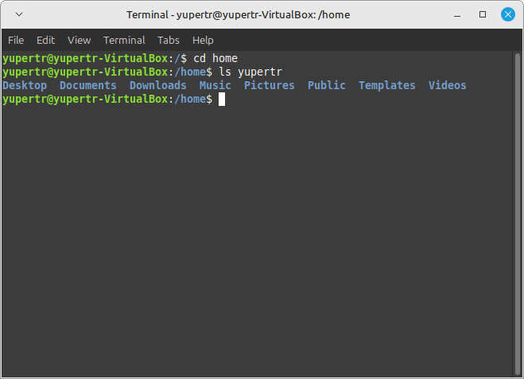
### ``cd``
* **Açıklama**: Kullanıcının istediği belirli klasöre gider. Belli bir klasöre gitmek istiyorsan cd /home/user/Desktop gibi bir komut kullanabilirsin.
```bash
cd [dizin]
```

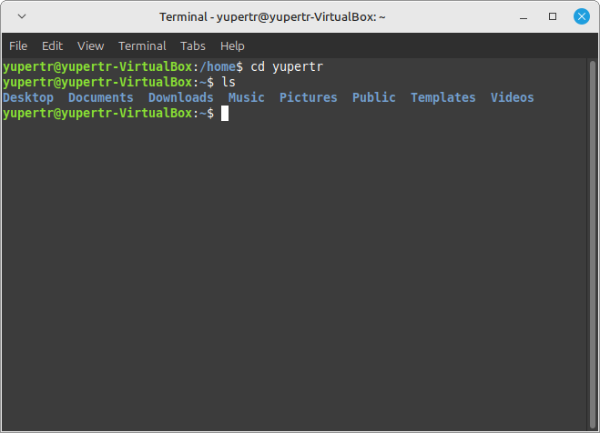
### ``mkdir``
* **Açıklama**: Belirtilen konumda yeni bir dizin oluşturur. Dizin yazaran yere bir isim yazman yeterlidir.
```bash
mkdir [dizin]
```
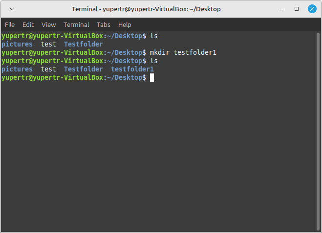
### ``rmdir``
* **Açıklama**: İsmini belirtilen dizini siler. Silmek istediğiniz dizinin içinde hiçbir dosya ve dizin olmamalıdır.
```bash
rmdir [dizin]
```

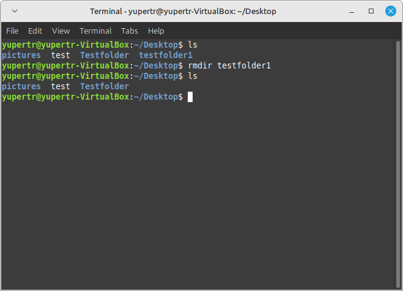
### ``cp``
* **Açıklama**: Belirtilen dosyayı belirtilen hedefe kopyalar. Bellirli bir konuma kopyalamak istiyorsan cp /home/user/Desktop/ 
```bash
cp [dosya] [hedef]
```


### ``rm``
* **Açıklama**: Belirtilen dosyayı siler. Belirli bir konuma silmek istiyorsan rm /home/user/Desktop/test.py gibi bir komut kullanabilirsin.
```bash
rm [dosya]
```

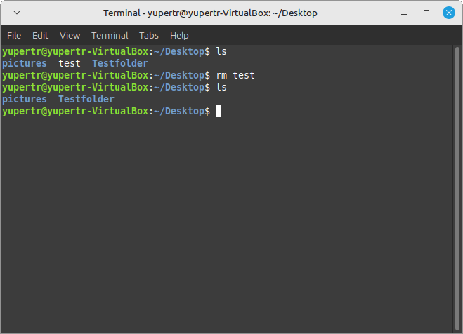
### ``mv``
* **Açıklama**: Dosya ve dizinleri yeniden adlandırır veya taşır.
```bash
mv [eski_ad] [yeni_ad]

mv [kaynak] [hedef]
```

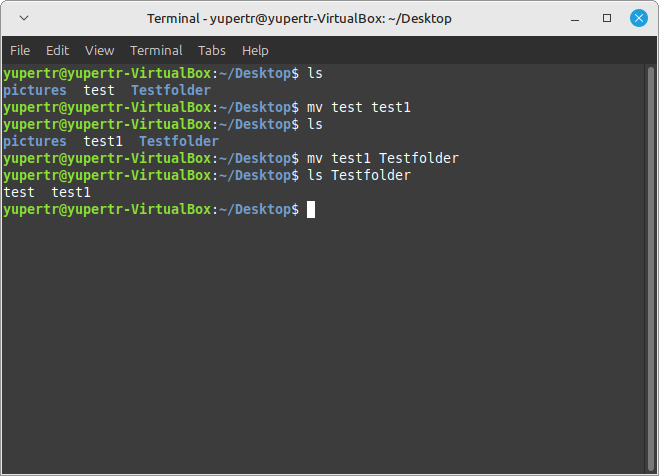
### ``clear``
* **Açıklama**: Terminal ekranını temizler.
```bash
clear
```


### ``man``
* **Açıklama**: Komutların kılavuz sayfalarını gösterir. Bir komutun nasıl kullanıldığını öğrenmek istiyorsan man komutunu kullanabilirsin.
```bash
man [komut]
```
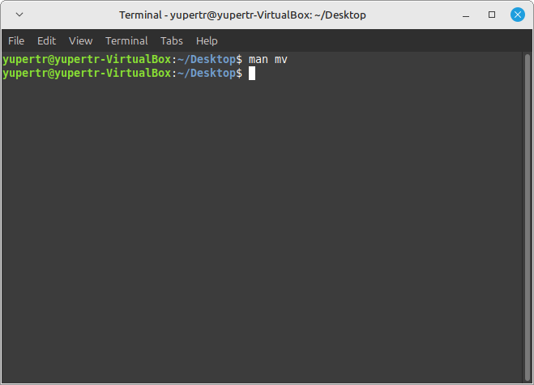
### ``exit``
* **Açıklama**: Terminali kapatır.
```bash
exit
```
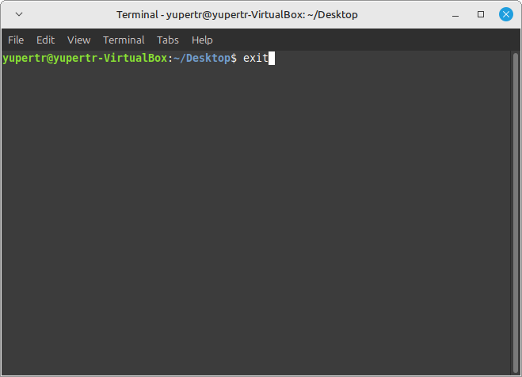
### ``cat``
* **Açıklama**: Belirtilen dosyanın içeriğini görüntüler.
```bash
cat [dosya]
```
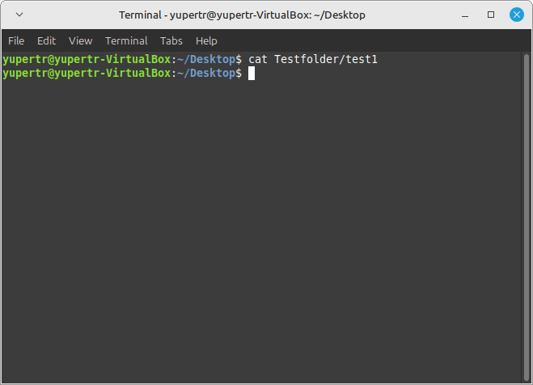
### ``echo``
* **Açıklama**: Belirtilen metni ekrana yazdırır veya belirttiğin dosyanın içeriğini girdiğin değerle değiştirir.
```bash
echo [metin]

echo [metin] > [dosya]
```
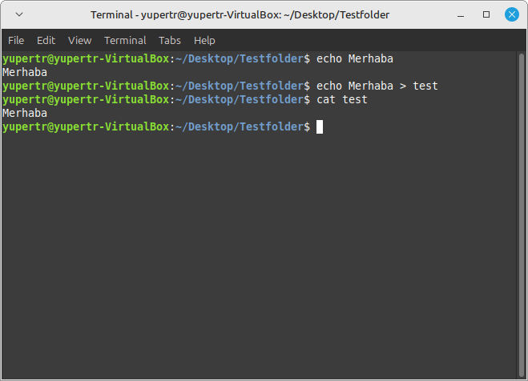
### ``date``
* **Açıklama**: Sistem tarihini görüntüler veya ayarlar. Tarihi ayarlamak istiyorsan date -s "2023-01-01 12:00:00" gibi bir komut kullanabilirsin.
```bash
date
date -s "2023-01-01 12:00:00"
```
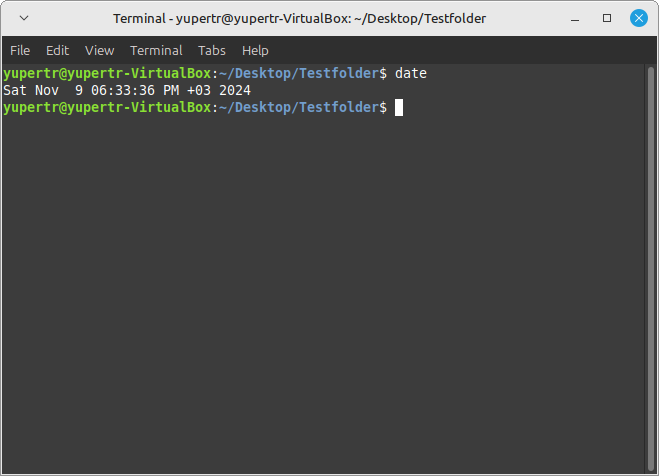
### ``uname``
* **Açıklama**: Sistem bilgilerini görüntüler.
```bash
uname -a
```
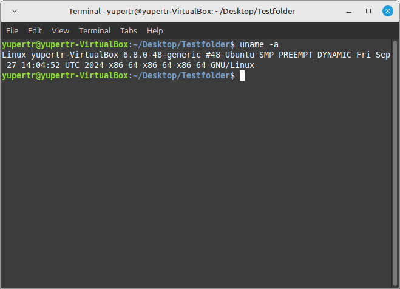
### ``ps``
* **Açıklama**: Çalışan işlemleri gösterir. Bütün işlemleri görmek istiyorsan ps aux komutunu kullanabilirsin.
```bash
ps aux
```
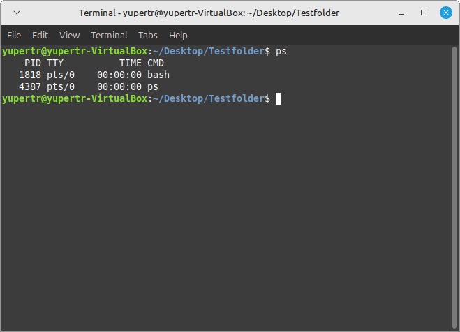
### ``kill``
* **Açıklama**: Belirtilen işlemi sonlandırır. PID'yi bilmiyorsan killall komutunu kullanabilirsin.
```bash
kill [PID]

killall [işlem_adı]
```
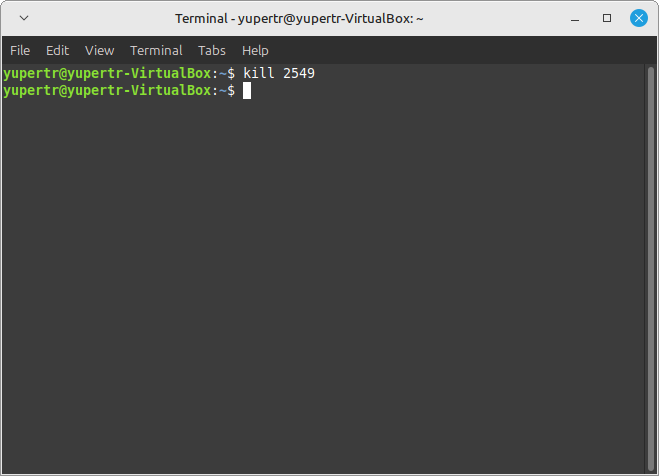
### ``ifconfig``
* **Açıklama**: Ağ adaptörü yapılandırmasını görüntüler.
```bash
ifconfig
```
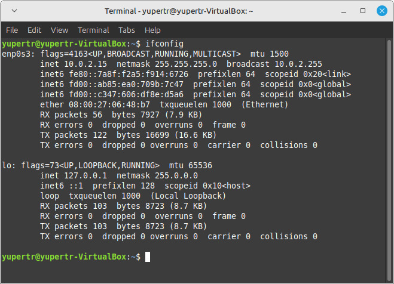
### ``ping``
* **Açıklama**: Belirtilen adrese ağ bağlantısını test eder. Bellirli bir adresi pinglemek istiyorsan ping 192.168.1.1 gibi bir komut kullanabilirsin.
```bash
ping [adres]
```
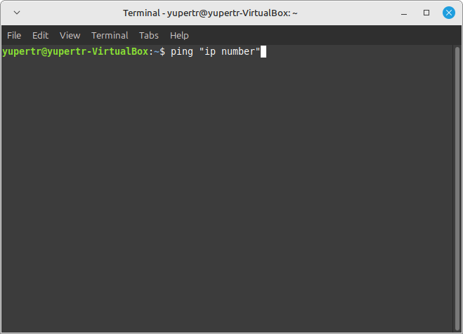
### ``netstat``
* **Açıklama**: Ağ bağlantılarını ve portları görüntüler.
```bash
netstat
```
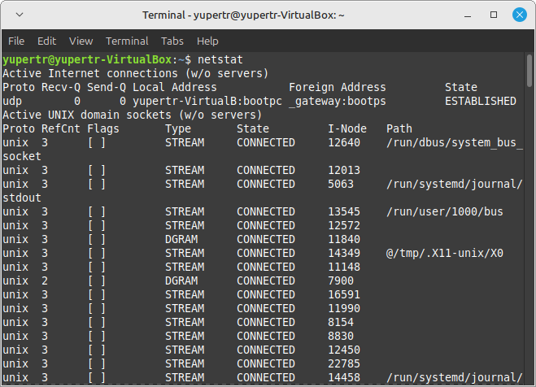

### ``diff``
* **Açıklama**: İki dosyayı karşılaştırır.
```bash
diff [dosya1] [dosya2]
```
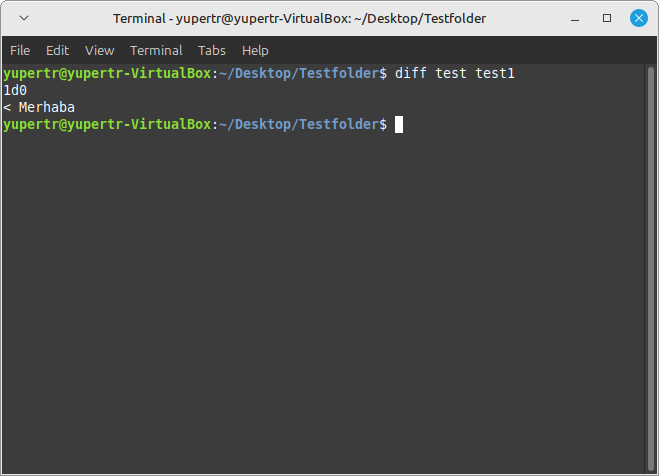
