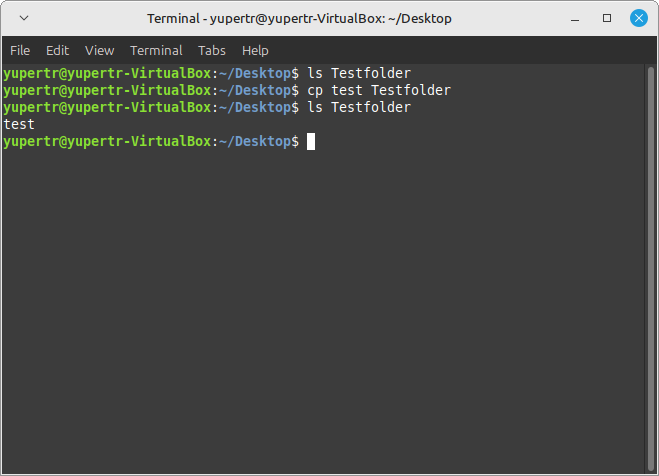

# Linux Terminal Komutları
## Giriş ve Açıklama
Bu dosya Linux işletim sistemi için kullanılan komutların açıklamalarını içerir.
## Komutlar
### ls
* **Açıklama**: Belirtilen dizindeki dosya ve klasörleri listeler.
```bash
ls [dizin]
 ```


### cd
* **Açıklama**: Belirtilen dizine geçer.
```bash
cd [dizin]
```


### mkdir
* **Açıklama**: Belirtilen konumda yeni bir dizin oluşturur.
```bash
mkdir [dizin]
```

### rmdir
* **Açıklama**: Belirtilen konumdaki boş dizinleri siler.
```bash
rmdir [dizin]
```


### cp
* **Açıklama**: Belirtilen dosyayı belirtilen hedefe kopyalar.
```bash
cp [dosya] [hedef]
```


### rm
* **Açıklama**: Belirtilen dosyayı siler.
```bash
rm [dosya]
```


### mv
* **Açıklama**: Dosya ve dizinleri yeniden adlandırır veya taşır.
```bash
mv [eski_ad] [yeni_ad]

mv [kaynak] [hedef]
```


### clear
* **Açıklama**: Terminal ekranını temizler.
```bash
clear
```


### man
* **Açıklama**: Komutların kılavuz sayfalarını gösterir.
```bash
man [komut]
```

### exit
* **Açıklama**: Terminali kapatır.
```bash
exit
```

### cat
* **Açıklama**: Belirtilen dosyanın içeriğini görüntüler.
```bash
cat [dosya]
```

### echo
* **Açıklama**: Belirtilen metni ekrana yazdırır veya dosyaya yönlendirir.
```bash
echo [metin]

echo [metin] > [dosya]
```

### date
* **Açıklama**: Sistem tarihini görüntüler veya ayarlar.
```bash
date
```

### uname
* **Açıklama**: Sistem bilgilerini görüntüler.
```bash
uname -a
```

### ps
* **Açıklama**: Çalışan işlemleri gösterir.
```bash
ps aux
```

### kill
* **Açıklama**: Belirtilen işlemi sonlandırır.
```bash
kill [PID]

killall [işlem_adı]
```

### ifconfig
* **Açıklama**: Ağ adaptörü yapılandırmasını görüntüler.
```bash
ifconfig
```

### ping
* **Açıklama**: Belirtilen adrese ağ bağlantısını test eder.
```bash
ping [adres]
```

### netstat
* **Açıklama**: Ağ bağlantılarını ve portları görüntüler.
```bash
netstat
```

### chmod
* **Açıklama**: Dosya izinlerini değiştirir.
```bash
chmod [izinler] [dosya]
```

### diff
* **Açıklama**: İki dosyayı karşılaştırır.
```bash
diff [dosya1] [dosya2]
```

